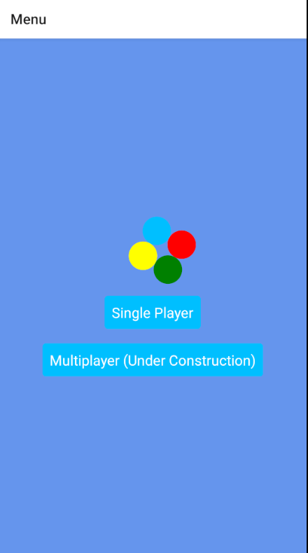
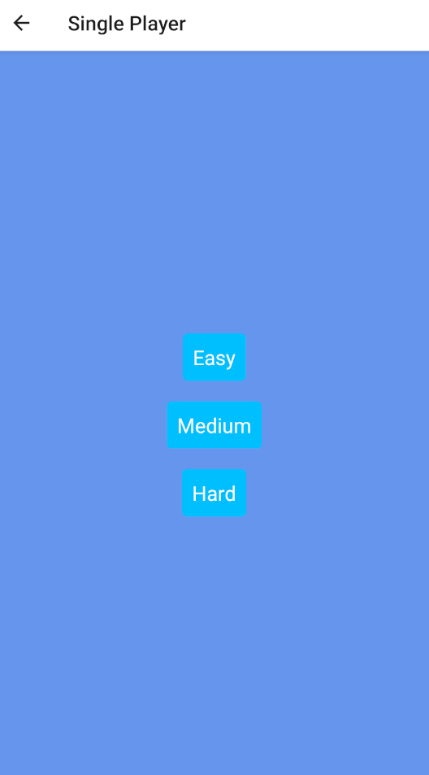
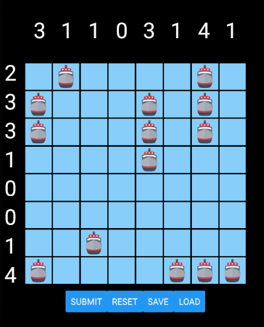

# Sink-Or-Swim-Battleship
A simple variation of Battleship Solitaire and Multiplayer Battleship using React Native and React Hooks. Currently under development.

To run application, run `npm install` to have the required dependencies and then `npm start` or `expo start`. The app is currently being developed using an Android Emulator (Pixel 3a) and may vary on devices.
Alternatively, you can install the Expo app from the Google Playstore and scan the QR code provided when you start the app using the instructions in the line above.

Phase 1 of the application is complete, single player mode is ready for play.
Next Steps: Work on Multiplayer Mode utilizing the Socket.io library

Game Instructions and Notes:

Note: Initially I wanted to develop this app using TypeScript but learning both React Native and TS in about 10 days seemed like I was biting off more than I could chew so I opted to use the PropTypes library to get a small taste of using type checking by applying it to the props.

Once the app has loaded, you can select the "Single Player" game mode which then presents the player with three modes of difficulty to choose from

Next the player will be enter the puzzle and be presented with the puzzle consisting of an X and Y axis and an 8x8 grid that accepts a tap/click action.
The goal is to place the ship marker to indicate where the battleships are hidden. Correctly placing all of the markers on the board and submitting will meanyou have solved the puzzle.
The numbers presented in the axes are dynamically generated by counting how many ships are in the answer key puzzle and are there as a guide to solving the puzzle. Each number represents where in each row and column lies a battleship.

In the puzzle/game screen, there are four buttons below which provide different functions (Submit puzzle, Reset board, Save progress, and Load last saved progress).

1. Firstly, the submit button compares the current state of the grid with the answer key (two arrays being compared) and if they equal then the puzzle is solved
2. The Reset board loads the initial empty puzzle grid array to clear the board
3. Save allows the player to save the current progress using React Native's AsyncStorage
4. Load also uses AsyncStorage to get the state that was set to bring the last saved game state.

Game Demo images below is approximately what you can expect to see.

